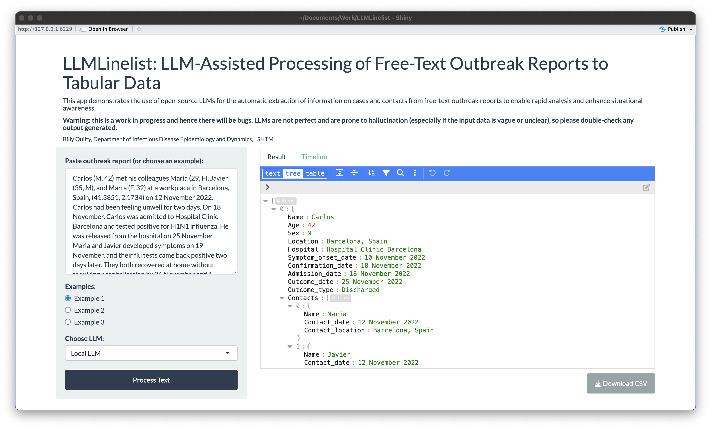

# LLMLinelist: LLM-Assisted Processing of Free-Text Outbreak Reports to Tabular Data



## Overview

This Shiny app is designed to demonstrate the LLM-assisted processing of free-text outbreak reports into epidemiologically useful tabular data - i.e., a linelist. It utilizes a small open-source LLM run locally on your machine to generate a table of cases and contacts from a free-text outbreak report. The app allows users to paste a report into the interface for automatic processing.

**Warning: this is a work in progress and hence there will be bugs. LLMs are not perfect and are prone to hallucination (especially if the input data is vague or unclear), so please double-check any output generated.**

## Getting Started

### Prerequisites

-   R & R Studio (<https://posit.co/download/rstudio-desktop/>)
-   LM Studio (<https://lmstudio.ai/>)
-   A reasonably powerful machine (tested on a 2021 Macbook Pro (M1 Pro with 16GB RAM); a report took about 10-30 seconds to process)

### Installation

1.  Clone this repository to your local machine:

    ``` bash
    git clone https://github.com/bquilty25/LLMLinelist.git
    ```

2.  Open the R project in your preferred R development environment (RStudio recommended when using Shiny).

## Option 1: Installing and running the local LLM

1. Install LM Studio: Follow the instructions on the [official LM Studio website](<https://lmstudio.ai/>) to download and install LM Studio.
2.  Open LM Studio.
3.  Navigate to the Search tab and search for "TheBloke/Mistral-7B-Instruct-v0.2-GGUF" (GGUML not yet supported by LMStudio)
4.  Download the "Q6_K" model (5.94GB, recommended).
5.  Choose an appropriate preset on the right-hand side ("Phi 2" works best).
6.  Navigate to the "Local Server" tab ("\<-\>" icon) and click "Start Server".

## Option 2: Run via GPT-3.5/4 using the OpenAI API

1. Sign up for an OpenAI account.
2. Navigate to the "API Keys" tab and create a new API key.
3. Copy your OpenAI API key and run the following command in R (replacing `sk-xxx` with your API key) to add it to your R environment:

``` r
Sys.setenv(OPENAI_API_KEY = "sk-xxx")
```

Note: this costs money, so make sure you monitor your usage and set a budget.

### Running the app

1.  Return to R and install the required R packages:

    ```r 
    install.packages(c("shiny", "shinyjs", "future", "shinythemes", "DT", "tidyverse", "ggpubr", "remotes"))
    remotes::install_github("daattali/shinycssloaders")
    ```

2.  Run the Shiny app:

    ``` r
    shiny::runApp()
    ```

## Usage

1.  Open the app in your web browser.

2.  Enter text, or choose an example input.

3.  Click the "Process Text" button to initiate the processing.

4.  Explore the generated table and timeline plot in their respective tabs.

5.  Export table in your required format.

## Contributing

Contributions are welcome! If you find any issues or have suggestions for improvements, please open an issue or create a pull request.

## License

This project is licensed under the [MIT License](LICENSE).

## Acknowledgments

-   Developed by Billy Quilty, Research Fellow, LSHTM

-   Many thanks to:

    -   Pratik Gupte

    -   Sam Clifford

    -   Noel Kennedy

    -   Adam Kucharski

    -   Roz Eggo

    -   Chrissy Roberts

    -   Michael Marks

    -   and others in CMMID and at LSHTM for their useful input and feedback.
